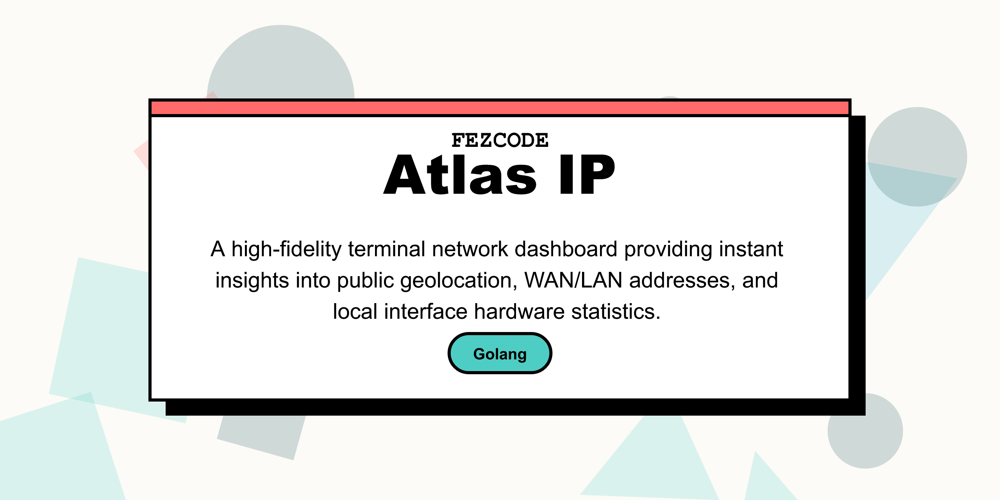

# atlas.ip


Fast, minimal tool to fetch your local and public IP address with geolocation data.





## Build

```bash

gobake build

```


## Usage


```bash

./atlas.ip

```


## Features

- Fetches local IP addresses.

- Fetches public IP address using `ip-api.com`.

- Provides geolocation data (City, Region, Country).

- Shows ISP and Timezone.

